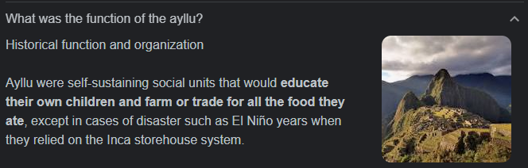

# About Ayllu

## What is Ayllu?

Ayllu Academy is one of the core projects of Impacto Labs; a social enterprise based in Canada that seeks to employ new technologies to solve problems in Latin America.

With a multi-national team, Ayllu aims to bring a new Learn-to-Earn eLearning modality to Latin America, one that incentivizes participation to promote growth in a technology oriented educational landscape, and relevant job industry.

We share an Open Source Philosophy, and believe tools can become more robust and add better value to everyone if they are built by everyone.

## But... what is an Ayllu?

For those interested in the history behind it, our name takes inspiration from  the clans that formed a basic socioeconomic unit of Inca Society: Ayllu

Their Function:

